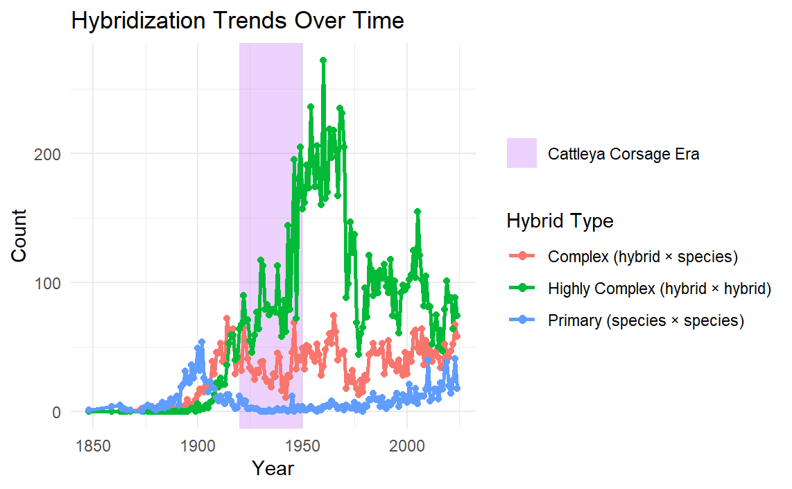
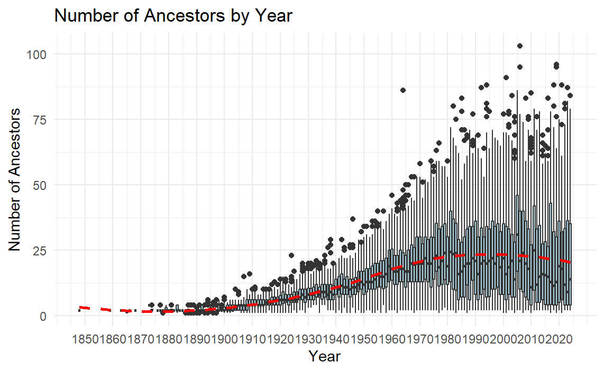
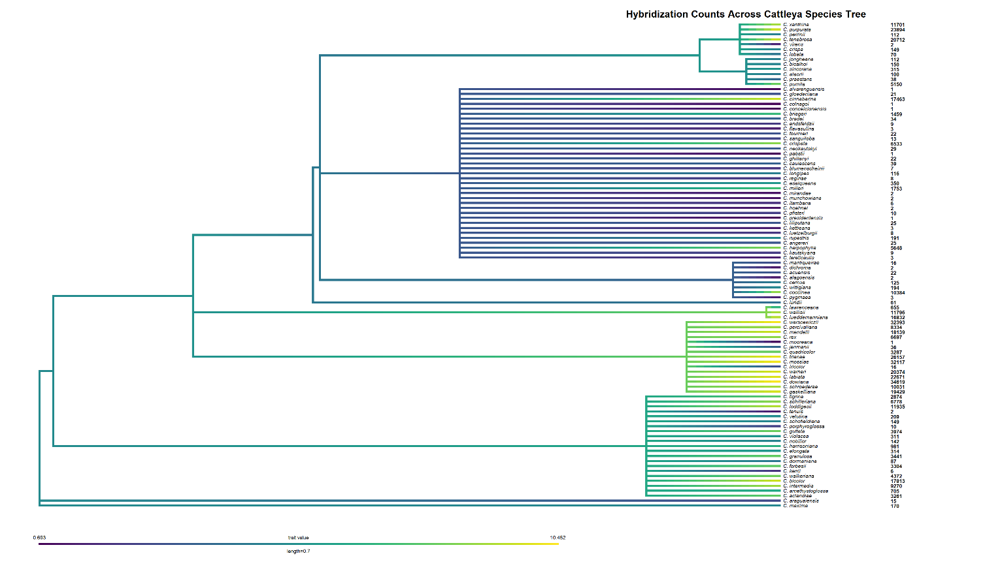
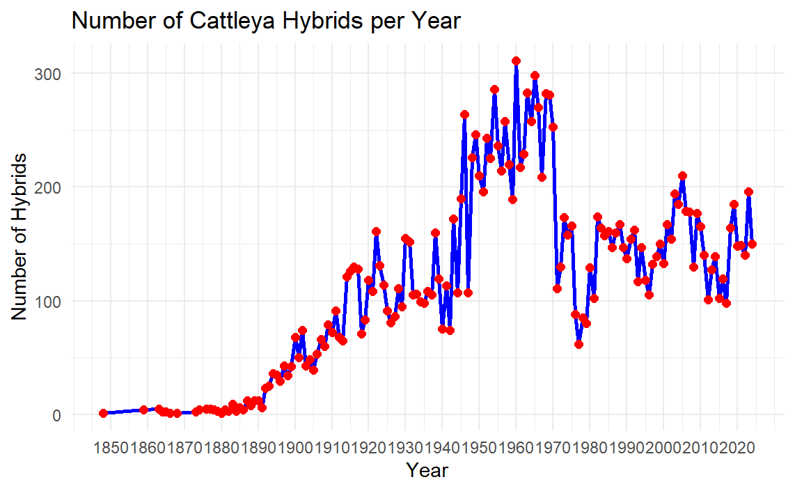
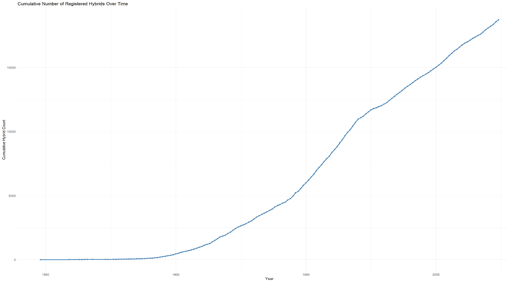

# _Cattleya_ Orchid Hybridization is Increasing Over Time and Correlated with Phylogeny

**Jaret Arnold** — May 2025

> Course write-up, bioinformatics. The text below is the submitted document verbatim; the original `.docx` is in [`docs/`](docs/). Figures are placed at their point of reference, with the original captions where the document supplied them.

## Abstract

Hybridization in the genus _Cattleya_ (Orchidaceae) has been documented extensively by the Royal Horticultural Society (RHS), serving as a rich dataset to evaluate anthropogenic hybridization over time (Cribb & Butterfield, 2002). Using data scraped from orchidroots.com, rates of man-made hybridization and yearly trends can be determined to help understand how humans interact with and create new _Cattleya_ hybrids. Specifically, this work serves to investigate if hybridization has increased over time and if those hybrids have become more complex (containing an increasing number of species in their ancestry). Additionally, it also functions as a resource to examine potential phylogenetic hybridization signal. Results show the rate of hybridization and complexity have been gradually increasing since records began in the 1850s. Phylogenetic signal tests on reconstructed species trees revealed significant phylogenetic signal using Pagel's lambda (p-value = 2e-06), Abouheif's Cmean (p-value = 0.001), and Moran's I (p-value = 0.001), all supporting the conclusion of phylogenetic clustering of hybridization.

## Introduction

### Hybridization as an Evolutionary Force

Natural hybridization is reported to occur in many organisms including many plant species, though it has been traditionally viewed as a rare event. Growing research indicates it is a more significant and frequent evolutionary process (Mallet, 2007). In his book _Natural hybridization and evolution_, Michael Arnold defines natural hybridization as "involving successful matings in nature between individuals from two populations, or groups of populations which are distinguishable on the basis of one or more heritable characters". Growing evidence has shown that hybridization may be conducive to speciation and adaptive radiation (Mallet, 2007; Abbot et al., 2013). In plants, features like weak reproductive barriers, polyploidy, and flexible pollination systems further enhance hybridization potential (Stebbins, 1959; Rieseberg & Carney, 1998). In addition, hybrid zones are important to reveal insights of reproductive isolation in progress, dynamic gene flow, and ecological novelty (Barton & Hewitt, 1985).

However, hybridization is not uniformly distributed across the tree of life, with some clades much more prone to hybridization than others. Traits like ecological overlap, floral morphology, genetic compatibility, and pollinator behavior have been shown to influence hybridization frequency among lineages (Whitney et al., 2010). It remains unclear whether the tendency to hybridize is a phylogenetically conserved trait or instead reflects more recent ecological and anthropogenic pressures. In the context of increasing environmental change, understanding the consequences of hybridization is more important than ever (Anderson, 1949; Lexer & Widmer, 2008).

### Anthropogenic Influences & Floriculture

Outside of natural hybridization, humans have played a large role in the creation of hybrids through agriculture and breeding of ornamental crops. In _Orchidaceae_ alone, we see over 120,000 hybrids primarily of man-made origin. Anthropogenic hybridization introduces other confounding variables in comparison to natural hybrids. For instance, hybrids are often selected for aesthetics rather than fitness in ornamental crops. Despite this, the ability to hybridize readily under artificial conditions may reflect a latent biological potential rather than an overt human effort. Understanding anthropogenic hybridization can help to illuminate patterns of compatibility, selection bias, and potential future diversification.

### The Orchid Family & the _Cattleya_ System

_Orchidaceae_ is one of the most diverse plant families with approximately 28,000 species recognized (Dressler, 1993). Hybridization is rampant in this family, both of natural and artificial origin. Since the mid-19th century when Dominy created the first artificial orchid hybrid of _Calanthe_, orchid breeding has expanded drastically. Many of new hybrids even include intergeneric hybrids of up to three, four and even five genera (Jangyukala & Hemanta, 2021). _Cattleya_, in particular, serve as a useful model due to its horticultural value and widespread use in man-made hybrids. Some other genera which are commonly used in hybridization include _Vanda_, _Dendrobium_, _Phalaenopsis_, _Cattleya_, _Oncidium_, and _Cymbidium_. In addition, _Cattleya_ (often referred to as the "corsage orchid") serves as an excellent test system for its cultural significance during the early-to-mid-20th century, where it prompted extensive hybridization programs in Europe and North America (Motes, 2021). Therefore, this genus offers a unique opportunity to examine how latent biological potential and cultural relevance intersect to shape hybridization patterns.

### Study Objectives

This study leverages curated RHS hybrid data (scraped from orchidroots.com) and phylogenetic methods to test whether hybridization frequency in _Cattleya_ exhibits phylogenetic signal. Hybridization trends and hybrid "complexity" (i.e. ancestral depth) are evaluated over time, and statistical tests (Pagel's lambda, Blomberg's K, Abouheif's Cmean, Moran's I) are applied to determine whether closely related species tend to produce similar numbers of hybrids. Understanding whether hybridization exhibits phylogenetic structure can offer insight into the dynamics of artificial selection and diversification in one of the world's most hybridized plant groups.

## Methods

### Data collection

Data for these analyses were collected by web-scraping from orchidroots.com on March 12th, 2025 using Jupyter Notebook (v7.2.2) with python (v3.12.7). Web scraping was performed using BeautifulSoup and Selenium with Google Chrome and Chromedriver. By scraping the data from orchidroots, numerous variables about hybridization and species in the genus of interest were collected quickly. The variables scraped included grex name, parentage, registrant, originator, year, number of ancestors, number of descendants, and other metadata. Species-level information was collected and included binomial, author, year, subgeneric rank, number of descendants, and image count. The scraped data were imported into RStudio (v2024.09.0) and cleaned by removing synonymous hybrids, subspecies/variants, and the current year (2025) of data to allow for more accurate representation of hybridization trends. Text parsing functions in the tidyverse package were used to extract data like ParentA/ParentB and hybrid complexity. The variables were then visualized in R using ggplot2.

### Phylogenetic Tree

Reconstruction of a phylogenetic tree was based off of Van den Berg's 2014 article which outlined subgeneric ranks for the species of this clade. As there were no recent phylogenetic trees at the species level, the subgeneric topology was used a map to affix each species as a polytomy according to the prior Van den Berg publication to compare results using a more accurate phylogeny in comparison to the subgeneric rank tree. Branch lengths in this tree were estimated using Grafen's (Grafen, 1989) method to allow for downstream statistical analyses.

### Statistical Analyses

Phylogenetic signal was analyzed using Pagel's lambda, Blomberg's K, Abouheif's Cmean and Moran's I. These were performed on the initial subgeneric tree from Van den Berg as well as the built species-level tree. Afterwards the trees were plotted using a heatmap colored by using the log + 1 of the species count of hybrids to help better visualize potential signal in different areas of the phylogeny.

### Data Availability

The python code for scraping orchidroots.com in addition to code for R plots can be found on the following github repository (<https://github.com/musharna/OrchidRootsScraper>). A shortened data frame can be found in Table S1.

## Results

### Trends in Hybridization & Complexity

Hybridization of the _Cattleya_ genus has increased since their species classification in the early 1800s (Figure S1) with more than 20,000 man-made hybrids created to this day. Despite the continued use of _Cattleya_ in hybridization, more complex trends require the consideration of other variables. For instance, early hybrids were mainly primary crosses (species × species) but by the early 20th century, complex hybrids became much more common (Figure 1). Notably, during the era of high economic importance (the "Corsage Era") complexity of hybrids increased dramatically before sharply dropping as its role in floriculture subsided. In recent decades hybrid types have diversified.

**Figure 1.** Hybridization trends in the _Cattleya_ genus since the 1850's. The years noted for their significance as Corsage orchids are colored in purple and hybrids are discerned by their parental makeup.

Another proxy used to examine hybrid complexity was the distribution of the number of ancestors each hybrid had on a yearly basis (Figure 2). Similarly to Figure 1, we see very few total ancestors in early hybrids and as time passes, we see a greater average number of ancestors as well as a much wider distribution of the number of ancestors. This trend was increasing around the 1950's but appears to have plateaued or declined in recent years.

**Figure 2.** Distribution of the number of ancestors per registered hybrid, by year of registration (boxplots), with the yearly mean overlaid in red.

### Phylogenetic Signal

Phylogenetic signal was tested using Pagel's Lambda and Blomberg's K to determine if there was a phylogenetic correlation amongst the value of hybrids in the _Cattleya_ genus. A tree at the subgeneric rank level with Grafen scaling was tested and showed no significance for Pagel's Lambda, Blomberg's K, Moran's I, or Abouheif's Cmean. The subsequent species-level tree was again tested for phylogenetic signal. Again, Blomberg's K resulted in an insignificant result, but Pagel's lambda, Moran's I, and Abouheif's Cmean were all significant. Pagel's lambda was strongly significant for the species tree with a p-value of 2.2e-6 indicating robust support for phylogenetic signal. Abouheif's Cmean and Moran's I also indicated a significant phylogenetic signal indicating similarly numbered hybrid counts tend to cluster. The phylogeny was then visualized with the log + 1 hybrid values to corroborate phylogenetic signal clustering (Figure 3).

**Figure 3.** _Cattleya_ species tree with branches coloured by log(hybrid count + 1); raw descendant-hybrid counts are listed at right of each tip. High-count species cluster in the _labiata_-group region of the tree rather than being scattered across it — the visual counterpart of the significant Pagel's lambda / Moran's I / Abouheif's Cmean results in Table 2.

## Discussion

### Hybridization Trends

While the raw number of _Cattleya_ hybrids continues to increase yearly, whether hybridization will continue at this pace remains to be determined. Peak values of hybrids produced per year were concentrated in the late 1950's when _Cattleya_ corsages were still in their heyday. Despite this, values of hybrids per year appear to be increasing gradually since their prime (Figure S1), but this trend has a remarkable amount of variation due to the lengthy development process of _Cattleya_ hybrids as well as different sociological trends. In addition, current trends examining hybrid complexity show a shift from being primarily highly complex (hybrid × hybrid) in the 1950's to being a relatively even mixture of primary, complex, and highly complex in present days. Therefore, we are now seeing an increase in the hybridization of not only complex hybrids but also primary hybrids. Ancestry amount distribution also served as a way to examine hybrid complexity by examining how the average number of ancestors has changed over time (Figure 2). Generally, we see an increasing number of ancestors since the 1850's and a widening distribution of ancestry number as time passes. In addition, the average ancestry number appears to have dropped in recent years which coincides with the decreasing proportion of highly complex hybrids since the 1950's. Thus, ancestry number trends appear to indicate that complexity has increased over time, but the rate may be slowing in recent years.

### Phylogenetic Signal

The analysis of phylogenetic signal proved some intriguing results. For one, the tree composed entirely of subgeneric ranks appeared to be less effective at estimating phylogenetic signal in comparison to a species tree made of polytomies at the subgeneric rank level. This reiterates the importance of incorporating species-level structure even with polytomies.

### Limitations and Future Directions

There are many considerations that need to be made regarding some limitations of this analysis. For instance, in testing for breeding trends, as mentioned previously there are limitations examining yearly trends given the considerable lag time from hybridization to ability to register a hybrid (reproductive maturity/flowering). Also, many hybrids are never registered and therefore the true record of hybridization is likely much more complex than the data leads on. Some hybrids may not be registered because of the cost associated or commonly commercial growers use "trade names" rather than an officially registered hybrid.

The phylogenetic signal test also presented many limitations too that could likely be improved in a future analysis given more data on the clade. For instance, phylogenetic information for this genus is limited to subgeneric ranks. Because of the lack of phylogenetic information, only topology was available for this genus and downstream analyses required creating branch lengths to run subsequent phylogenetic signal tests. Grafen scaling was used to make an estimate at what the species level tree may look like, but the reality is likely more complex with more variation in branch lengths. The _Orchidaceae_ family is in a state of near constant taxonomic flux and that is also a limitation experienced in this analysis. Many new species continue to be described of _Cattleya_ which makes assessing trends of species difficult given some had so recently been discovered. Finally, the tests themselves are not without limitations as some are shown to have some degrees of bias depending on phylogenetic topology (especially under polytomies). To address this a variety of tests for phylogenetic signal were used and particularly ones that are robust to the polytomies used in the species tree.

Despite the limitations, there remains great potential to continue this analysis in many ways. For instance, updated phylogenetic information of this genus could allow for more accurate assessments of signal. Another key aspect that could be investigated is correlation of the numbers of man-made hybrids to natural hybrids. Given a large distribution of _Cattleya_ is in Brazil it is no surprise there are many hybrid zones which allow for natural hybrids, but whether that is responsible for the high amount of hybridization or if it is an anthropogenic effect needs more information before conclusions can be made.

## Tables

**Table 1.** The sample hybrid data frame (… to indicate data between the beginning and end of frame). The full scrape is not redistributed with this repository — see [`data/README.md`](data/README.md) for why, and for the derived aggregates the figures are built from.

| Grex Name                | Parentage                                             | Registrant                 | Originator   | Year | Ancestors (#) | Descendants (#) |
| ------------------------ | ----------------------------------------------------- | -------------------------- | ------------ | ---- | ------------- | --------------- |
| _Cattleya_ Arthur Desmet | _Cattleya_ Adela (1898) × _Cattleya_ Callistoglossa   | Lambeau                    | Lambeau      | 1908 | 6             | NA              |
| _Cattleya_ Atalanta Lane | _Cattleya_ Atalanta (1894) × _Cattleya_ Leafwood Lane | R.J. Midgett               | J. Passander | 2006 | 6             | 4               |
| …                        | …                                                     | …                          | …            | …    | …             | …               |
| _Cattleya zaslawskii_    | _Cattleya harpophylla_ × _Cattleya praestans_         | (L.C.Menezes) Van den Berg | R.Govaerts   | 2010 | 2             | NA              |

**Table 2.** Results of phylogenetic signal testing.

| Tree                 | Blomberg's K | P-val (Blomberg's) | Pagel's Lambda | P-val (Pagel's) | Moran's I | P-val (Moran's) | Abouheif's Cmean | P-val (Abouheif's) |
| -------------------- | ------------ | ------------------ | -------------- | --------------- | --------- | --------------- | ---------------- | ------------------ |
| Subgeneric rank tree | 0.768        | 0.405              | ~0.00004       | 1               | −0.105    | 0.478           | −0.095           | 0.338              |
| Species level tree   | 0.184        | 0.339              | 0.305          | 2.20E−06 \*     | 0.13      | 0.001 \*        | 0.32             | 0.001 \*           |

\* Statistically significant

## Supplemental Figures

**Figure S1.** A line plot of the number of hybrids made each year from the 1850's to present.

**Figure S2.** Cumulative number of registered _Cattleya_ hybrids over time. (This panel appeared in the submitted document without a caption; the caption here is descriptive.)

## References

Abbott, R., Albach, D., Ansell, S., Arntzen, J. W., Baird, S. J., Bierne, N., ... & Zinner, D. (2013). Hybridization and speciation. _Journal of Evolutionary Biology_, 26(2), 229–246. https://doi.org/10.1111/jeb.12099

Anderson, E. (1949). _Introgressive Hybridization_. Wiley.

Barton, N. H., & Hewitt, G. M. (1985). Analysis of hybrid zones. _Annual Review of Ecology and Systematics_, 16(1), 113–148. https://doi.org/10.1146/annurev.es.16.110185.000553

Blomberg, S. P., Garland, T., & Ives, A. R. (2003). Testing for phylogenetic signal in comparative data: Behavioral traits are more labile. _Evolution_, 57(4), 717–745. https://doi.org/10.1111/j.0014-3820.2003.tb00285.x

Cribb, P., & Butterfield, I. (2002). _The Genus Paphiopedilum: Orchid Register and Checklist_. Royal Horticultural Society.

Dressler, R. L. (1993). _Phylogeny and Classification of the Orchid Family_. Cambridge University Press.

Grafen, A. (1989). The phylogenetic regression. _Philosophical Transactions of the Royal Society B: Biological Sciences_, 326(1233), 119–157. https://doi.org/10.1098/rstb.1989.0106

Jangyukala, B., & Hemanta, B. (2021). A review of intergeneric hybridization in orchids: Diversity and conservation perspectives. _Journal of Orchid Research and Development_, 13(2), 45–54.

Lexer, C., & Widmer, A. (2008). The genic view of plant speciation: Recent progress and emerging questions. _Philosophical Transactions of the Royal Society B: Biological Sciences_, 363(1506), 3023–3036. https://doi.org/10.1098/rstb.2008.0076

Mallet, J. (2007). Hybrid speciation. _Nature_, 446(7133), 279–283. https://doi.org/10.1038/nature05706

Motes, M. (2021). The rise and fall of the corsage orchid. _Orchids: The Bulletin of the American Orchid Society_, 90(2), 115–123.

Pagel, M. (1999). Inferring the historical patterns of biological evolution. _Nature_, 401(6756), 877–884. https://doi.org/10.1038/44766

Rieseberg, L. H., & Carney, S. E. (1998). Plant hybridization. _New Phytologist_, 140(4), 599–624. https://doi.org/10.1046/j.1469-8137.1998.00315.x

Stebbins, G. L. (1959). The role of hybridization in evolution. _Proceedings of the American Philosophical Society_, 103(2), 231–251.

Van den Berg, C. (2014). A revised infrageneric classification for the genus _Cattleya_ (Orchidaceae). _Botanical Journal of the Linnean Society_, 175(1), 95–112.

Whitney, K. D., Ahern, J. R., Campbell, L. G., Albert, L. P., & King, M. S. (2010). Patterns of hybridization in plants. _Perspectives in Plant Ecology, Evolution and Systematics_, 12(3), 175–182. https://doi.org/10.1016/j.ppees.2010.02.002
